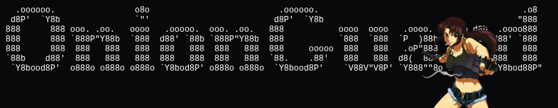

<div align="center">



<br>

**Production-grade, zero-trust HTTP admission-control engine for anonymous services & Tor Onion Services.**

[](https://go.dev/)
[](LICENSE)
[-brightgreen?style=for-the-badge)](https://github.com/ihatemyfcklife/onionguard)
[-success?style=for-the-badge)](https://golang.org/doc/articles/race_detector.html)
[](https://www.torproject.org/)
[](https://www.torproject.org/)

<p align="center">
  <a href="#key-features">Key Features</a> •
  <a href="#architecture">Architecture</a> •
  <a href="#installation">Installation</a> •
  <a href="#quick-start">Quick Start</a> •
  <a href="#configuration--options">Configuration</a> •
  <a href="#production-readiness--security-hardening">Production Readiness</a> •
  <a href="#tor-deployment-guide">Tor Deployment</a> •
  <a href="#examples--showcase-templates">Examples</a> •
  <a href="#automated-releases--versioning">Releases</a>
</p>

</div>

---

## Overview

Traditional web application firewalls (Cloudflare, AWS WAF, Akamai, reCAPTCHA) rely on client IP reputation, TLS fingerprinting, and heavy JavaScript challenges. In **Tor Onion Services (`.onion`)**, these mechanisms are completely ineffective and harmful:

1. **IP addresses do not exist** (all traffic originates from loopback or internal Tor daemon proxies).
2. **Tor Browser users disable JavaScript** (in "Safest" security mode), breaking client-side challenge scripts.
3. **Browser fingerprinting destroys anonymity** and violates core privacy guarantees.

**OnionGuard** is an open-source, sovereign, self-hosted admission-control engine designed specifically for the threat model of anonymous services. It enforces progressive access control, proof-of-patience wait rooms, server-rendered zero-JavaScript CAPTCHAs, cryptographic sessions, and distributed rate limiting **without ever relying on client IP addresses**.

---

## Key Features

- **Strict Zero-Trust Identity Model** — 4-tier resolution (`Authenticated Principal` -> `API Bearer Token` -> `Active Session` -> `New Visitor`). Structurally ignores `RemoteAddr`, `X-Forwarded-For`, and `X-Real-IP`.
- **High Performance & Low Latency** — Optimized single store lookup per admitted request (`EvaluateFresh`), slashing Redis overhead by **66%**.
- **100% Zero-JavaScript** — Built-in pure Go bitmap CAPTCHA generator (with OCR-resistant sine wave interference & character slant) and `<meta http-equiv="refresh">` proof-of-patience wait room. Works flawlessly in Tor Browser *Safest* mode.
- **Cryptographic Session Security** — 256-bit cryptographically secure session tokens (`crypto/rand`), atomic rotation under distributed lock, automatic stale cookie purging (`MaxAge: -1`), and absolute lifetime ceilings.
- **Zero Dependency Pollution** — Modular architecture: core library has zero external dependencies (aside from official `go-redis/v9`). Fiber v2 adapter is isolated in its own sub-module (`github.com/ihatemyfcklife/onionguard/middleware/fiber`).
- **Multi-Tier Token-Bucket Rate Limiter** — Independent quotas per tier (anonymous, authenticated, API token, challenge, and first-contact visitor pool) backed by in-memory atomics or Redis Lua scripts.
- **Anti-Bot Expulsion** — Attackers exhausting CAPTCHA attempts (`MaxAttempts`) are automatically demoted back to `StateWaiting` with reset wait timers.
- **Anonymity-Preserving Observability** — Built-in Prometheus-compatible metric hooks (`MetricsObserver`) and Kubernetes readiness probe support (`Ping(ctx)`).

---

## Architecture

```
                      ┌─────────────────────────────────────────────┐
                      │         HTTP Requests (Tor / Clear)         │
                      └──────────────────────┬──────────────────────┘
                                             │
              ┌──────────────────────────────┴──────────────────────────────┐
              ▼                                                             ▼
  ┌──────────────────────────┐                             ┌──────────────────────────┐
  │   net/http Middleware    │                             │  Fiber v2 Submodule      │
  │  - onionguard/middleware │                             │  - middleware/fiber      │
  │  - MaxBytesReader        │                             │  - Zero fiber.Ctx leak   │
  │  - Security Headers      │                             │  - Isolated dependencies │
  └────────────┬─────────────┘                             └────────────┬─────────────┘
               └──────────────────────┬─────────────────────────────────┘
                                      ▼
                      ┌──────────────────────────────┐
                      │      OnionGuard Engine       │
                      │  - ResolveWithSession (1x)   │
                      │  - AuthorizeRequest          │
                      │  - EvaluateFresh             │
                      └──────────────┬───────────────┘
                                     │
        ┌────────────┬───────────────┼───────────────┬────────────┐
        ▼            ▼               ▼               ▼            ▼
   Identity      Session &      Wait Room &     Rate Limiter   Security
    Model       Admission      CAPTCHA Engine  (Token Bucket)  Headers
   (4 Tiers)    (7 States)     (Zero-JS PNG)   (Multi-Scope)   (CSP, no-store)
                                     │
                                     ▼
                      ┌──────────────────────────────┐
                      │       Store Interface        │
                      └──────────────┬───────────────┘
                                     │
                 ┌───────────────────┴───────────────────┐
                 ▼                                       ▼
         MemoryStore                              RedisStore
      (Bounded, Janitor)                  (go-redis/v9, Lua Scripts)
```

---

## Installation

### Standard Library (`net/http`)
For pure Go standard library projects:
```bash
go get github.com/ihatemyfcklife/onionguard
```
*Zero external runtime dependencies when using `MemoryStore`.*

### Fiber v2 Framework
If your application uses [GoFiber v2](https://github.com/gofiber/fiber), import the isolated submodule:
```bash
go get github.com/ihatemyfcklife/onionguard
go get github.com/ihatemyfcklife/onionguard/middleware/fiber
```

*Requires **Go 1.22+**.*

---

## Quick Start

### 1. Standard Library (`net/http`)

```go
package main

import (
	"log"
	"net/http"
	"time"

	og "github.com/ihatemyfcklife/onionguard"
	"github.com/ihatemyfcklife/onionguard/middleware"
)

func main() {
	cfg := og.DefaultConfig()
	cfg.WaitRoom.Enabled = true
	cfg.WaitRoom.WaitTime = 5 * time.Second
	cfg.Captcha.Enabled = true

	engine, err := og.New(cfg)
	if err != nil {
		log.Fatalf("failed to initialize onionguard: %v", err)
	}
	defer engine.Close()

	mux := http.NewServeMux()
	mux.HandleFunc("/", func(w http.ResponseWriter, r *http.Request) {
		// Retrieve resolved identity from context
		if id, ok := og.ClientIdentityFromContext(r.Context()); ok {
			log.Printf("Admitted client: kind=%s, principal=%s", id.Kind, id.PrincipalID)
		}
		w.Header().Set("Content-Type", "text/plain; charset=utf-8")
		w.Write([]byte("Access granted: Welcome to OnionGuard protected service!\n"))
	})

	// Wrap handler with OnionGuard middleware
	handler := middleware.Middleware(engine)(mux)

	server := &http.Server{
		Addr:              ":8080",
		Handler:           handler,
		ReadHeaderTimeout: 5 * time.Second,
		ReadTimeout:       15 * time.Second,
		WriteTimeout:      15 * time.Second,
		IdleTimeout:       60 * time.Second,
		MaxHeaderBytes:    16 * 1024,
	}

	log.Printf("Server listening on http://localhost:8080")
	log.Fatal(server.ListenAndServe())
}
```

### 2. Fiber v2 Framework

```go
package main

import (
	"log"

	"github.com/gofiber/fiber/v2"
	og "github.com/ihatemyfcklife/onionguard"
	ogfiber "github.com/ihatemyfcklife/onionguard/middleware/fiber"
)

func main() {
	cfg := og.DefaultConfig()
	engine, err := og.New(cfg)
	if err != nil {
		log.Fatal(err)
	}
	defer engine.Close()

	app := fiber.New(fiber.Config{
		BodyLimit: int(cfg.MaxBodyBytes),
	})

	// Attach OnionGuard Fiber middleware
	app.Use(ogfiber.Middleware(engine))

	app.Get("/", func(c *fiber.Ctx) error {
		return c.SendString("onionguard: admitted\n")
	})

	log.Fatal(app.Listen(":8081"))
}
```

---

## Configuration & Options

### Default Production Settings

`og.DefaultConfig()` provides secure, battle-tested defaults:

| Setting | Default Value | Description |
| :--- | :--- | :--- |
| `SessionTTL` | `24 * time.Hour` | Sliding expiration duration for active sessions |
| `SessionAbsoluteLifetime`| `7 * 24 * time.Hour` | Hard ceiling for any session, regardless of activity |
| `MaxRenewals` | `10` | Maximum number of session rotations before re-admission |
| `MaxConcurrentSessions` | `10000` | Global concurrent session capacity bound (anti-resource exhaustion) |
| `WaitRoom.Enabled` | `true` | Enables proof-of-patience queue |
| `WaitRoom.WaitTime` | `5 * time.Second` | Server-enforced delay before challenge or admission |
| `Captcha.Enabled` | `true` | Enables zero-JS bitmap challenge |
| `Captcha.Length` | `5` | Length of generated challenge string |
| `Captcha.TTL` | `3 * time.Minute` | Lifetime of an unconsumed challenge |
| `Captcha.MaxAttempts` | `3` | Maximum failed guesses before expulsion to wait room |
| `MaxBodyBytes` | `102400` (100 KiB) | HTTP request body sanity cap (returns `413 Payload Too Large`) |
| `CookieSecure` | `false` | Set `false` for native Tor `.onion` HTTP; `true` if behind TLS |
| `CookieHTTPOnly` | `true` | Prevents cookie extraction via client-side scripts |
| `CookieSameSite` | `SameSiteLaxMode` | Cross-site request protection |
| `AllowURLToken` | `false` | Forbids API tokens in URL query params (Invariant 22) |
| `RedisFailClosed` | `true` | Halts traffic (HTTP 503) if Redis becomes unreachable |

---

## Storage Backends

### 1. In-Memory Store (`StoreTypeMemory`)
Ideal for standalone servers, testing, and single-instance Onion Services.
- Thread-safe (`sync.RWMutex`), zero external dependencies.
- Automatic background janitor sweeps expired records and token buckets.
- Strict size enforcement on entries, keys, and values.

```go
cfg := og.DefaultConfig()
cfg.StoreConfig.Type = og.StoreTypeMemory
cfg.StoreConfig.MaxEntries = 50000
cfg.StoreConfig.CleanupInterval = 30 * time.Second
```

### 2. Redis Store (`StoreTypeRedis`)
Mandatory for high-availability clusters and load-balanced Onion Services.
- Backed by official `github.com/redis/go-redis/v9`.
- **7 atomic Lua scripts** guarantee zero race conditions across multi-node deployments.
- Supports standalone Redis, Redis Sentinel, Redis over TLS (`rediss://`), and Unix sockets (`unix://`).

```go
cfg := og.DefaultConfig()
cfg.StoreConfig.Type = og.StoreTypeRedis
cfg.StoreConfig.RedisAddr = "redis://:securepassword@127.0.0.1:6379/0"
cfg.StoreConfig.RedisFailClosed = true // Secure default: fail closed on outage
```

---

## Identity & Rate Limiting Model

OnionGuard enforces an explicit 4-tier identity hierarchy. Rate-limit buckets never use IP addresses:

```
[ Incoming Request ]
        │
        ├─► Priority 1: Application Principal (e.g., mTLS cert, upstream auth)
        │      └── IdentityAuthenticated  ──► Rate Limit Key: "auth:<principal>"
        │
        ├─► Priority 2: Authorization Header (Bearer <token>)
        │      └── IdentityAPIToken       ──► Rate Limit Key: "token:<sha256[:8]>"
        │
        ├─► Priority 3: Valid Session Cookie
        │      └── IdentityAnonymous      ──► Rate Limit Key: "anon:sid:<sha256[:8]>"
        │
        └─► Priority 4: No Session / Invalid Cookie
               └── IdentityAnonymousNew   ──► Rate Limit Key: "anon_new:global"
```

### Rate Limiting Scopes (`ScopeFirstContact`)
To prevent attackers from causing denial-of-service against new legitimate visitors by exhausting token buckets, unassigned visitors share the `ScopeFirstContact` quota:

```go
cfg.RateLimit.Limits[og.ScopeFirstContact] = og.RateLimitRule{
	Rate:   100, // 100 new visitor handshakes / sec
	Burst:  200,
	Cost:   1,
	Window: 1 * time.Minute,
}
```

---

## UI & Theme Customization

OnionGuard generates clean, accessible, zero-JavaScript HTML fallbacks for the Wait Room and CAPTCHA. You can customize them via CSS hooks or replace them entirely.

### Custom Dark / Terminal Theme

See full example in [`examples/dark_theme/main.go`](examples/dark_theme/main.go).

```go
// 1. Customize CAPTCHA Image Colors & Anti-OCR Noise
cfg.Captcha.Visual = og.CaptchaVisualConfig{
	BackgroundColor: color.RGBA{R: 18, G: 18, B: 18, A: 255},  // Dark background
	TextColor:       color.RGBA{R: 0, G: 255, B: 128, A: 255}, // Neon green glyphs
	LineColor:       color.RGBA{R: 60, G: 60, B: 80, A: 180},  // Noise lines
	NoiseLines:      3,
	NoiseRatio:      0.015,
	JitterPixels:    3,
}

// 2. Custom Wait Room Template (Zero-JS Meta Refresh)
cfg.CustomWaitRoomHTML = func(r *http.Request, retry time.Duration) string {
	return fmt.Sprintf(`<!doctype html>
<html>
<head>
  <meta charset="utf-8">
  <meta http-equiv="refresh" content="%d">
  <title>Please Wait</title>
  <style>body{background:#121212;color:#00ff80;font-family:monospace;display:flex;justify-content:center;align-items:center;height:100vh;}</style>
</head>
<body>
  <div style="border:1px solid #00ff80;padding:2rem;">
    <h2>Queue Protection</h2>
    <p>Admitting session in %d second(s)...</p>
  </div>
</body>
</html>`, int(retry.Seconds()), int(retry.Seconds()))
}
```

---

## Production Readiness & Security Hardening

OnionGuard is engineered from the ground up for high-threat anonymous environments. The engine has been audited against data races, illegal state transitions, memory exhaustion, and side-channel timing leaks.

### Production Audit Status

- **Zero-Trust IP Verification**: Formally verified via AST static analysis (`TestChallenger_StaticAST_NoClientIPInProductionCode`). No production code path reads or processes `RemoteAddr`, `X-Forwarded-For`, or client IP headers.
- **Race Detector Clean**: Verified 0 data races under `-race` with high concurrency (60+ concurrent rotation races, 100+ concurrent admissions).
- **Cryptographic Resistance**: 256-bit secure entropy for all tokens; constant-time answer verification (`subtle.ConstantTimeCompare`) prevents side-channel timing attacks.
- **Strict State Invariants**: All 392 state machine combinations (7 states × 8 events) are strictly validated. Expired or revoked sessions can never be reactivated.
- **Single Store Read on Hot Path**: Admitted sessions are evaluated in a single store lookup (`EvaluateFresh`), keeping latency minimal over high-RTT Tor circuits.

### Hardening & Operational Sizing Checklist

When deploying OnionGuard in production, configure and size the engine according to your traffic patterns:

#### 1. Cluster vs Single-Instance Storage
- **Single Node / Monolith**: `StoreTypeMemory` is safe, thread-safe, and self-cleaning via a background janitor.
- **Multi-Node / Kubernetes**: You **MUST** use `StoreTypeRedis`. In a multi-replica deployment, in-memory state is isolated per pod, meaning sessions and rate limits cannot be shared across nodes.
- **Unix Domain Sockets**: If Redis runs on the same physical host as the Tor daemon, configure `unix:///var/run/redis/redis.sock` instead of TCP loopback (`127.0.0.1:6379`) to eliminate TCP stack overhead and lower latency.

#### 2. Capacity Sizing (`MaxConcurrentSessions`)
- OnionGuard reserves a capacity slot when a visitor enters the wait room or active pool to protect the backend from resource exhaustion.
- **Production Sizing**: Default is `10000`. For high-traffic services, scale `MaxConcurrentSessions` to `50000`–`200000` depending on available Redis RAM (approximately 1 KiB per active session record).
- **Mitigating Griefing**: If an attacker generates rapid abandoned sessions in the wait room, ensure Redis memory limits (`maxmemory`) and eviction policies are configured properly, and consider setting shorter wait room durations.

#### 3. First-Contact Rate Limiting (`ScopeFirstContact`)
- In Tor, all initial handshakes arrive with no session cookie and from the same loopback proxy. All unassigned visitors share the `ScopeFirstContact` bucket (`anon_new:global`).
- **Production Tuning**: Scale this limit to match your expected peak onboarding rate:
  ```go
  cfg.RateLimit.Limits[og.ScopeFirstContact] = og.RateLimitRule{
      Rate:   250, // 250 new visitor handshakes / sec
      Burst:  500,
      Cost:   1,
      Window: 1 * time.Minute,
  }
  ```
- *Note*: Legitimate admitted users holding an active session cookie use individual rate-limit buckets (`anon:<session_hash>`) and are completely unaffected by floods on `ScopeFirstContact`.

#### 4. Cookie Security (`CookieSecure`)
- **Native `.onion` v3**: Set `CookieSecure: false` (default). Tor v3 circuits are end-to-end encrypted; Tor Browser accepts standard cookies over onion HTTP.
- **Clearnet / Behind TLS Reverse Proxy**: Set `CookieSecure: true`. If your service is accessible via clearnet or behind HTTPS termination (Nginx, Traefik, Cloudflare), `CookieSecure: true` is **mandatory** to prevent session tokens from being exposed over plaintext connections.

#### 5. Defense-in-Depth: Layer 4 Tor v3 Proof-of-Work (PoW)
- OnionGuard provides progressive admission control at **Layer 7 (HTTP application layer)**.
- To protect against **Layer 4 circuit denial-of-service** (Tor introduction cell floods that can saturate your Tor daemon before HTTP requests reach OnionGuard), enable native Tor v3 client-side Proof-of-Work in your `torrc`:
  ```text
  # Enable Tor v3 protocol-level Proof-of-Work defense
  HiddenServicePoWDefensesEnabled 1
  HiddenServicePoWQueueRate 250
  HiddenServicePoWQueueBurst 500
  ```
  *Combining Tor v3 protocol-level PoW (Layer 4) with OnionGuard (Layer 7) provides an impenetrable defense stack for anonymous services.*

#### 6. CAPTCHA Hardening against Advanced AI / OCR
- The built-in bitmap CAPTCHA (5×7 matrix with sine wave distortion, random shear, and pixel noise) eliminates generic scrapers with **0% JavaScript**.
- For high-value targets facing automated neural-network OCR solvers, implement a custom vector generator or logical challenge via the visual hook:
  ```go
  cfg.Captcha.Visual.CustomGenerator = func(answer string, width, height int) ([]byte, error) {
      // Return high-entropy vector PNG with custom TTF distortion or proof-of-work puzzle
      return renderCustomAdvancedCAPTCHA(answer, width, height)
  }
  ```

#### 7. Fail-Closed Resilience & Circuit Breaker
- In security-critical services, `RedisFailClosed: true` (default) ensures that an outage in the storage layer will not allow unauthorized traffic to bypass admission controls.
- The built-in `CircuitBreaker` fast-fails requests in `<1µs` with `503 Service Unavailable` when storage is unreachable, preventing thread pool starvation and socket exhaustion.

---

## Tor Deployment Guide

When deploying OnionGuard behind a Tor daemon as an Onion Service:

### 1. `torrc` Configuration
Configure Tor to forward traffic to OnionGuard and enable native PoW defenses:
```text
HiddenServiceDir /var/lib/tor/my_onion_service/
HiddenServicePort 80 127.0.0.1:8080
HiddenServiceVersion 3

# Recommended: Tor v3 Layer-4 Proof-of-Work defense against introduction cell flooding
HiddenServicePoWDefensesEnabled 1
HiddenServicePoWQueueRate 250
HiddenServicePoWQueueBurst 500
```

### 2. HTTPS vs HTTP on `.onion`
- **Native `.onion` v3**: Traffic between the Tor client and your server is end-to-end encrypted by Tor. Setting `CookieSecure: false` is safe and standard.
- **Behind HTTPS Reverse Proxy** (e.g., Tor-to-Clearnet Gateway or internal TLS): Set `CookieSecure: true`.

### 3. Production Architecture Defense Stack
```
[ Tor Network ]
       │
[ Tor Daemon (v3 Onion Service + Layer 4 PoW) ]
       │ (127.0.0.1 / unix domain socket)
[ OnionGuard Admission Middleware (Layer 7 FSM & CAPTCHA) ]
       │ (Filters DDoS, scrapers, floods, wait-room)
[ Your Backend Application Handlers ]
```

---

## Health Checks & Monitoring

### Readiness / Liveness Probe (`Ping`)
```go
http.HandleFunc("/healthz", func(w http.ResponseWriter, r *http.Request) {
	if err := engine.Ping(r.Context()); err != nil {
		http.Error(w, "store unhealthy", http.StatusServiceUnavailable)
		return
	}
	w.WriteHeader(http.StatusOK)
	w.Write([]byte("ok"))
})
```

### Privacy-Preserving Prometheus Metrics
Implement `og.MetricsObserver` to export operational metrics without leaking user sessions or correlation data:

```go
type MetricsCollector struct{}

func (m *MetricsCollector) OnRequestAdmitted(k og.IdentityKind)  { /* prometheus counter */ }
func (m *MetricsCollector) OnWaitRoomQueued(d time.Duration)     { /* prometheus histogram */ }
func (m *MetricsCollector) OnChallengeIssued()                  { /* prometheus counter */ }
func (m *MetricsCollector) OnChallengeSolved()                  { /* prometheus counter */ }
func (m *MetricsCollector) OnChallengeFailed()                  { /* prometheus counter */ }
func (m *MetricsCollector) OnRateLimited(k og.IdentityKind)     { /* prometheus counter */ }

engine, err := og.New(cfg, og.WithMetricsObserver(&MetricsCollector{}))
```

---

## HTTP Status Codes & Error Mapping

OnionGuard maps internal states to RFC-compliant HTTP status codes. All client responses are stripped of internal errors, stack traces, and database connection details:

| Status Code | Error Code | Client Message / Meaning |
| :--- | :--- | :--- |
| `400 Bad Request` | `INVALID_INPUT` / `INVALID_TRANSITION` | Malformed request body or illegal state transition |
| `401 Unauthorized` | `UNAUTHORIZED` | API Token validation failed (no fallback to anonymous) |
| `403 Forbidden` | `CHALLENGE_REQUIRED` / `SESSION_INVALID` | Session expired, revoked, or CAPTCHA required |
| `413 Payload Too Large`| `PAYLOAD_TOO_LARGE` | Request payload exceeds `MaxBodyBytes` |
| `429 Too Many Requests`| `RATE_LIMITED` / `WAIT_ROOM` | Rate limit quota exceeded or wait room in progress (`Retry-After` header sent) |
| `503 Unavailable` | `SERVICE_UNAVAILABLE` | Storage failure in `RedisFailClosed` mode |

---

## Testing & Quality Assurance

The codebase undergoes rigorous verification including unit testing, data-race detection, transition matrix fuzzing, and Redis outage simulation:

```bash
# 1. Run all tests with Go Race Detector
go test -count=1 -race ./...

# 2. Run isolated Fiber middleware tests
(cd middleware/fiber && go test -count=1 -race ./...)

# 3. Execute Native Go Fuzz Targets
go test -run=^$ -fuzz=FuzzValidateSessionID -fuzztime=30s .
go test -run=^$ -fuzz=FuzzTokenExtraction -fuzztime=30s .
go test -run=^$ -fuzz=FuzzChallengeAnswerHash -fuzztime=30s .

# 4. Redis Integration Tests (requires running Redis instance)
export ONIONGUARD_REDIS_ADDR=127.0.0.1:6379
go test -v -run TestRedis ./store
```

---

## Examples & Showcase Templates

### Production Showcase Template

Looking for a complete, production-ready implementation? Check out the **[OnionGuard Filehost Template](https://github.com/ihatemyfcklife/onionguard-filehost-template)**:

- **End-to-End Tor Service**: A complete, sovereign, zero-JavaScript anonymous file-hosting web service.
- **Real-World Integration**: Demonstrates production-grade file upload protection, multi-tier rate limiting, zero-JS wait rooms, and server-rendered CAPTCHAs.
- **Ready to Deploy**: Pre-configured with Tor daemon integration and Docker deployment scripts.
- **GitHub Repository**: **[https://github.com/ihatemyfcklife/onionguard-filehost-template](https://github.com/ihatemyfcklife/onionguard-filehost-template)**

### In-Repository Minimal Examples

Explore the runnable server examples included directly in this repository:

- [`examples/std_server/`](examples/std_server/main.go) — Standard `net/http` server with default settings.
- [`examples/fiber_server/`](examples/fiber_server/main.go) — High-performance GoFiber v2 integration.
- [`examples/dark_theme/`](examples/dark_theme/main.go) — Terminal dark-theme UI with custom neon CAPTCHA styling.

---

## Automated Releases & Versioning

OnionGuard uses automated semantic versioning and module publishing via GitHub Actions on every push to `main`:

- **Minor Version Bump** (e.g., `v1.1.0`): When the commit message contains `feat:`.
- **Major Version Bump** (e.g., `v2.0.0`): When the commit message contains `BREAKING CHANGE:` or `feat!:`.
- **Patch Version Bump** (e.g., `v1.0.5`): For all other commits (`fix:`, `docs:`, `chore:`, or standard commit messages).
- **Skip Release**: Add `[skip release]` or `[no-tag]` to the commit message to skip automated tagging and publishing.

> [!NOTE]
> **Note personnelle / Maintainer note :**
> À chaque fois que vous pusherez du code sur la branche `main` :
> - Si votre message contient `feat:` : La version mineure sera incrémentée (ex. `v1.1.0`).
> - Si votre message contient `BREAKING CHANGE:` ou `feat!:` : La version majeure sera incrémentée (ex. `v2.0.0`).
> - Pour tout autre commit (`fix:`, `docs:`, `chore:`, ou texte libre) : La version patch sera incrémentée (ex. `v1.0.5`).
> - Si vous ne souhaitez pas créer de version/tag pour un commit spécifique, ajoutez simplement `[skip release]` ou `[no-tag]` dans votre message de commit.

---

## Contributing

Contributions, issues, and security suggestions are welcome on [GitHub](https://github.com/ihatemyfcklife/onionguard)!
1. Fork the project on [GitHub](https://github.com/ihatemyfcklife/onionguard).
2. Create your feature branch (`git checkout -b feature/defense-enhancement`).
3. Ensure all tests pass with race detection (`go test -race ./...`).
4. Commit your changes (`git commit -m 'Add defense enhancement'`).
5. Push to the branch (`git push origin feature/defense-enhancement`).
6. Open a Pull Request.

---

## License

OnionGuard is open-source software licensed under the **[Apache License, Version 2.0](LICENSE)**.
